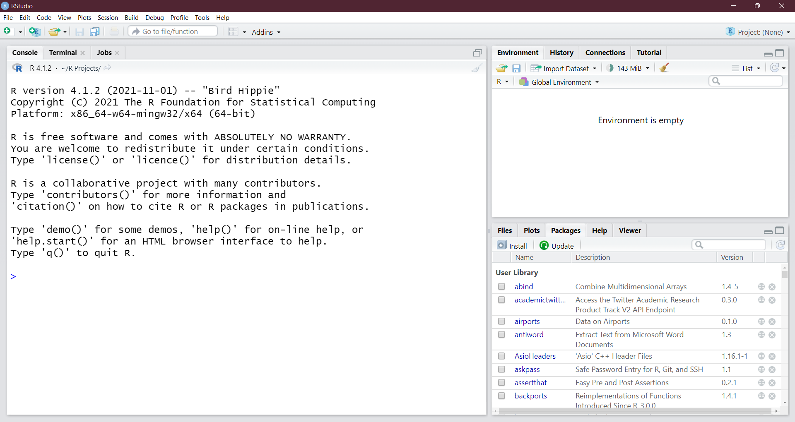

# R Module 1

```{r setup-rm1, include=FALSE}
knitr::opts_chunk$set(
  fig.align = "center",
  message = F
)

```

```{r klrm1, echo = F, include = T}
klippy::klippy()
```


## What is R?

R, or the *R Project for Statistical Computing*, is a programming language designed for use in data analysis and data science. Initially developed in 1993, R has become one of the most popular languages for data science, due to its design towards statistics and data.

R is popular in geographical data science, as there are many packages (add-on libraries of pre-built tools and functions) that can be used to perform GIS, Remote Sensing, or qualitative analyses.

## R Studio

R Studio is a popular IDE (*Integrated Development Environment*) that allows for more convenient programming in the R language. Rather than running R programs (*scripts*) from the command line, R Studio allows users to interactively write and execute scripts, as well as view data and file paths in a single environment. R Studio also allows users to manage and install packages, generate plots and figures, and "knit" code into a .PDF or .HTML for making reports.

```{=html}
<!--
### R Markdown

For writing up documents and reports, text editors like Word and Google Docs do the job, but sometimes we need to include figures, data, or reports. Rather than constantly taking screenshots (and updating them when things change!) we can use R Markdown to create comprehensive documents that automatically include figures and tables *directly from the data*. R Markdown has a bit of a learning curve, especially compared to Word, but once we cover the basics, it becomes easy to make documents and reports (this R Module was written entirely in R Markdown!)
-->
```
\newpage

------------

## Getting Started

In order to use R and R Studio, you'll need to download and install them onto your computer. If you've used R before, make sure you're using at least version 4.1.2 to make sure everything runs smoothly.

Navigate to these websites to download the right version for your device (versions for both Windows and Mac exist!)

-   [Download R 4.1.2 for Windows 32/64-bit](https://cran.r-project.org/bin/windows/base/)

-   [Download R for macOS](https://cran.r-project.org/bin/macosx/)

-   [Download RStudio](https://www.rstudio.com/products/rstudio/download/#download)

### R Studio Interface

```{r rstudio-example, echo = F, out.width = "100%", fig.align = 'center', fig.cap = "The default interface for RStudio" }


```

Above is a screenshot of RStudio's interface; notice that the main window is divided into different "panes", each with a different purpose. The main panes we'll use in this class are the *Console* (left), *Environment* (upper right), *Files / Plot Viewer* (bottom right), and *Scripts* (not shown). These panes are useful for different tasks:

-   The Console is used to write code and view its output. This is (for now) where we'll run all of our code, and where we can see the results of our operations.
-   The Environment tab shows different datasets and variables that we assign -- we'll get into this more in future R Modules.
-   The Files tab gives us a view into our *working directory*, a "default folder" that we can use to call other files, scripts, or data.
-   The Plots tab is used when we generate a plot or image (e.g., with the `plot()` or `hist()` functions).
-   The Scripts window is essential for staying organized in your projects; scripts are used to save R code to a file, which is necessary to stay organized, and allows you to pick up where you left off, rather than having to re-type code each time you start an R session.

The other tabs and panes are useful, but those listed above are the most commonly-used.

------------

## Basics of R

### Exploring data

To begin with our first R Module, let's load and explore some basic data. For starters, we need to start RStudio; load the program from your computer and you should see an interface like what's shown above.

Let's look at some introductory data - in this case, the *painters* dataset from the *MASS* package, which is included within R. Follow the directions below to load and view the dataset; I'll explain as we go along. To start, type the following into the **console** --- the part of the window with the blue [`>`]{style="color: blue;"} icon --- and then hit the `Enter` key.

```{r mass}
library(MASS)

head(painters)
```

When you see code in these boxes, that's code that can be run in RStudio (and what's cool is that this document was written entirely in RStudio, so the code you see is *actually* being run in an R session).

So, when we run this code, we get a table (technically, a `data.frame`) of names and various attributes of historical painters. But what did we actually run? The `library()` function takes the name of an R package and loads it into the workspace. Because some packages take a long time to load, the user has to specify which ones are loaded into memory, as opposed to loading the $\approx 18,000$ packages on the *Comprehensive R Archive Network* (*CRAN*) -- a network of servers that store code for R.

We used `library(MASS)` to load the `MASS` package; note the capitalization -- `library(mass)` will not work! After we loaded this package, we called `head(painters)` to look at the head -- by default the first 6 rows -- of the `painters` dataset.

***TIP: If you're not sure what a function in R does, you can enter a `?` before the function in the console, e.g., `?head()` to view documentation, arguments, and examples of the function***

We can also view specific variables in the dataset with **the `$` operator**; for example, `painters$School` gives us:

```{r painters-school, echo = F}

painters$School
```

We can also see from this **Use R to produce the following simple data summaries and visualizations commonly used for qualitative data:**

1.  A histogram of the `Composition` variable from the `painters` dataset, using the `hist()` function.

2.  A **horizontal** bar chart of the `Expression` variable, using the `barplot()` function.

    -   *Tip: use \`?barplot() to see which argument you need to change to get a horizontal bar plot*

3.  A pie chart of the `Schools` variable, using the `pie()` function.

    -   *Hint: you need to wrap the `pie()` function around the `table()` function, because you need **frequencies** of each school, rather than just their label*

------------------------------------------------------------------------

\newpage

## Importing and Visualizing Quantitative Data

Now, we'll work with a different dataset; the tutorials in this section are based on a built-in dataset called `faithful`, from the pre-loaded `datasets` package. It consists of a collection of observations of the Old Faithful geyser in Yellowstone National Park.

There are two observation variables in the dataset. The first one, `eruptions`, is the duration of geyser eruptions. The second one, `waiting`, is the length of the waiting period until the next eruption. Use the function `head()` to examine these two observations.

We can also view some summary statistics on this dataset, such as mean, median, etc.:

```{r faithful-summary}

summary(faithful)
```

Let's try some more meaningful summaries for quantitative data using R. Just as before, produce the following and put your output into your document.

4.  A histogram for the eruptions. R will automatically decide how to group your observations. Remember to plot *only* the `eruptions` variable.

5.  Another histogram of eruptions, but specify 2 data classes instead of the default values.

    -   *Hint: use `?hist()` to see more documentation on the `hist()` function.*

6.  A boxplot of eruptions that is horizontal, rather than vertical.

    -   Use `?boxplot()` to figure out how to change the orientation.

7.  Repeat steps 4-6 on a dataset of your own choosing and interpret the data. You can also use functions such as `mean`, `median`, `quantile`, etc. to help interpret your data.

If you've made it this far, then congrats -- you're learning R! Once you're done celebrating, give your document a title or header called "R Module 1", add your name, and turn it in to Google Classroom. Bring any questions, insights, comments, or concerns to the next class!
