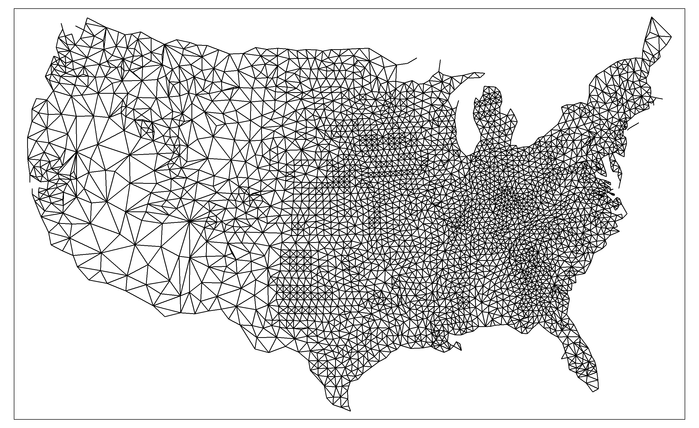

```{r setup, include = FALSE}
knitr::opts_chunk$set(
  fig.align = 'center',
  message = FALSE
)
```


***

# Spatial Regression in R

Regression residuals are the primary way to assess if a regression violates any assumptions of the general linear model. Although all the assumptions are important, the violation of the assumption of independence is common with spatially organized data. This has led to the development of a family of alternate regression models that can accommodate spatial dependence. We'll work with two of theme models continuing from the previous two R Modules. These are known as the *spatial lag model* and *spatial error model*. Both models account for spatial dependence by including new parameters that must be estimated; each model, however, handles this in a different way...

## Spatial Lag Model

The spatial lag model, shown below, introduces a new explanatory variable and an associated coefficient that must be estimated:

$$ y = \rho W_y + \beta X + \varepsilon$$

The new variable, $W_y$, is the "lag variable" and represents, for each spatial unit, the weighted average of the values of the observations among its neighbors (when working with a row-standardized matrix). 

The term $\beta X$ represents our independent variables, and epsilon ($\varepsilon$) is our "error term", which describes the amount by which an observed value differs from the expected value, based on the whole population.

Just like in "normal" regression models, there exists a correlation coefficient, in this case rho ($\rho$), and for spatial regression the value of $\rho$ must be estimated. $\rho$ is one of the key statistics; our null hypothesis is that $\rho = 0$, which represents zero spatial dependence in the $W_y$ dependent variable.

A statistically significant result, therefore is when $\rho \neq 0$, meaning we have successfully adjusted our model to account for any spatial dependence. 

As with Moran's I, $\rho$ can be either positive, indicating positive spatial dependence, or negative, indicating negative spatial dependence. 


## Spatial Error Model


The other model we have is known as the *spatial error model*. Unlike the lag model, the error model addresses spatial dependence by separating the error term $\varepsilon$ into two components: one that contains the "random error" ($\xi$), and one that contains the spatially-autocorrelated error components ($\lambda W_\varepsilon$):

$$y = \beta X + \varepsilon; \;\varepsilon = \lambda W_\varepsilon + \xi$$

As with the spatial lag model, the spatial error model has a coefficient, lambda ($\lambda$), which must be estimated. The remaining errors, xi ($\xi$), should be randomly distributed as per the conventional general linear model. The interpretations of $\lambda$ are similar to that of $\rho$ in the lag model, as is the hypothesis test informed by the coefficient's value and $p$-value (i.e., our null hypothesis is that $\lambda = 0$)


# Importance of Spatial Autocorrelation

Both of these models are computationally intensive and require the extra steps of defining a neighborhood construct and its associated weighted matrix, so why bother with calculating this?

The problem of spatially autocorrelated residuals means that we **really** can't trust our results. Think about it like this: if values that are spatially close to one another have similar values, if we don't account for spatial autocorrelation, our variables appear to have strong correlation. Not only that, without accounting for spatial autocorrelation, our $p$-values are much lower, so it  also looks like our model is much more statistically significant. This is a long way to say that any inferences we make based on such models, without accounting for spatial autocorrelation, could be very inaccurate.

***

# Performing Spatial Regression

This week, we'll perform our spatial models on a new set of data: a Shapefile containing the results from the 2004 presidential election, and is available to download here:

http://www.personal.psu.edu/users/a/c/acr181/2004_Election.zip

Unzip this folder and load the results into R with `sf`. In addition, we'll need to transform (reproject) our data into a *crs* which uses linear units; we'll use the US National Atlas Equal Area, `EPSG:2163`. Refer to R Modules 8 and 9 on how to transform your data with `sf`.

By the way, if you want to look up more coordinate reference systems, check out https://epsg.io

```{r, include = FALSE}
library(sf)
library(tidyverse)
library(tmap)

election <- read_sf("export/2004_Election_Counties.shp") %>% 
  st_transform(crs = st_crs("EPSG:2163"))
```

For our data, we want to model the dependent variable as a function of our independent variable(s). Our DV is the percent of voters who voted for Bush, and our IV is per capita income. 

```{r bush}
library(tmap)

tm_shape(election) + 
  tm_polygons(
    col = "Bush_pct",
    border.col = NULL,
    style = "quantile",
    n = 7
  )

```

```{r, income}
tm_shape(election) + 
  tm_polygons(
    col = "pcincome",
    border.col = NULL,
    style = "quantile",
    n = 7
  )
```


Quick note, this data only covers the continental U.S.; can you think of a reason why?

Take a look at the dataset with tools like `View()` to familiarize yourself with the data and the variables.

## Spatial Weights

Let's make a spatial weights matrix, just as in previous Modules:

```{r spat-weights, warning= F}
library(spdep)

us_neighbors <- election %>% 
  poly2nb(queen = TRUE)

us_centroids <- st_centroid(election)

us_w <- us_neighbors %>% 
  nb2listw(
    style = "W",
    zero.policy = TRUE
  )
```

We can plot the connections to see if they look good:

<!-- Not actually plotting it in-document; it just takes a long time :) -->

```{r w, eval = FALSE}
us_neighbors %>%
  nb2lines(
    coords = us_centroids$geometry) %>% 
  qtm()
```

```{r neighbors, echo = FALSE, out.width="60%"}

```

We can run a global Moran's I or Geary's C test on both variables that we'll use in the regression models. First, let's test for spatial autocorrelation among the dependent variable, `Bush_pct`:

```{r, eval = FALSE}
moran.test(x = election$Bush_pct,
           listw = us_neighbors_w,
           zero.policy = TRUE)

geary.test(x = election$Bush_pct,
           listw = us_neighbors_w,
           zero.policy = TRUE)
```

Then, perform the tests on the independent variable, `pcincome`:

```{r, eval = FALSE}
moran.test(x = election$pcincome,
           listw = us_neighbors_w,
           zero.policy = TRUE)

geary.test(x = election$pcincome,
           listw = us_neighbors_w,
           zero.policy = TRUE)
```

What do the results show? Both variables are strongly and positively spatially autocorrelated, when using the Queen's case $W_{ij}$. This is a clue that we should see spatially autocorrelation among the residuals from a basic linear regression. If so, we'll need to use a spatial regression model (hint, we will!) to estimate the "true nature" of the relationship. 

## Questions

1. **Use `lm()` to estimate `Bush_pct ~ pcincome` using ordinary least squares (OLS). Plot the *residuals* on a map (look back to R Module 7) and *test the residuals for spatial autocorrelation*. Provide both an example of your map and the results from your spatial autocorrelation test in your R Markdown report.** 
  - Hint: Your results should look somewhat similar to the results below:
  
```{r resids, include = F}
lm <- lm(Bush_pct ~ pcincome, data = election,)

election$residuals <- lm$residuals

tm_shape(election) + 
  tm_polygons(col = "residuals",
              border.col = NULL,
              palette = "RdYlGn",
              style = "cont",
              midpoint = 0)
```
  
  