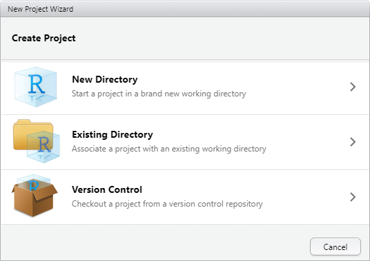
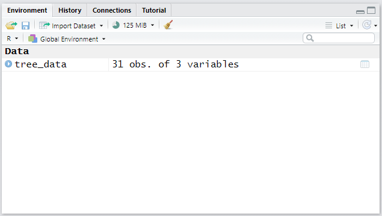

# R Module 2 {- #r-module-2}


## Working with R Scripts and Projects

In the previous R Module, we worked entirely within the context of the R *console*, which allowed us to run code line-by-line and see the results immediately. However, when working on more complex projects, it's important to be able to stay organized, not only for your own sake, but also to help potential collaborators understand your workflow, which includes the people troubleshooting issues in your code! R *scripts* are designed exactly for this; scripts are essentially text files that allow you to save, review, and edit your code, then run your code all at once! This is necessary when doing real-world programming in R — coding is an iterative process, in which you work on things step-by-step until you get the desired code!

```{r script-example, echo = F, fig.align = "center", fig.cap = "Example of an R script written in RStudio"}


```


### R Projects

R Projects are an important (and *essential*!) way of maintaining and organizing your work within RStudio. *Projects* can be thought of like folders; they're tools for containing all the scripts, files, and data that you need for your analyses. *Projects* also allow you to save all your progress, including the variables you create, the data you load, etc. You can also use *Projects* to save your workspace, so you can easily switch between working on class projects, R Modules, or whatever else you're doing, without losing any progress.

Let's start by creating a new R Project! Go ahead and open RStudio, and create a new Project by clicking `File > New Project...`

You'll then get this window:

```{r new-project-1, echo = F}

```

Then, Select `New Project`...

```{r new-project-2, echo = F}

knitr::include_graphics("img/NewProjectStep2.png")
```

Finally, enter "R Module 2" as the name of the directory, and browse to a folder where you can find the Project again (e.g., your `Documents` folder)...

```{r new-project-3, echo = F}

knitr::include_graphics("img/NewProjectStep3.png")
```

Once you've created your new Project, you'll see that you're working within the Project when you see an icon –  – in the top-right corner.

### Creating New Scripts

As stated earlier, *Scripts* are simply text files containing the commands that you would otherwise enter into the console. This makes it easy to save progress, return to code later, share your code with friends and loved ones, and more. Going forward, we'll use *Scripts* whenever we want to perform analyses for our R Modules, which makes it easier to troubleshoot our code. Feel free to continue using the *Console* when exploring the data, though!

Creating a new *Script* is very easy; either type `Cmd/CTRL-Shift-N`, or select `File > New File... > R Script`. You'll be greeted with a new *Script*, which can hold your code!

Let's try out a few basic things – exploring some data. For now, we'll use the `trees` dataset from the wonderful `datasets` package.

Enter the following into your script. By default, the `datasets` package is already loaded, but it's good practice to have all of your `library()` calls at the beginning of your scripts, which is why it's included here.

```{r trees-intro}
library(datasets)

tree_data <- trees
```

**N.B.:** The `<-` arrow is called an *assignment operator*, and takes a value on the right of the arrow and *assigns* it to a variable on the left. R also has the `=` operator, which works similarly, but for now stick to using `<-` to avoid confusion (there is a difference between `<-` and `=` but it's not important for now!).

You can run code from Scripts in several ways; either line-by-line, by entering `Cmd/CTRL-Enter`, or by running the entire script with `Cmd/CTRL-Alt-R`. Go ahead and run everything now.

What we've done so far is assign the `trees` dataset to the variable `tree_data`. You can see this variable in the **Environment** tab:

```{r tree-environment, echo = F}

```

Before we go any further, let's save our script (`Cmd/CTRL-S`) as `tree_data.R`...

Now, we'll get into the real content of why scripts are useful! Let's create some graphs and figures, but let's use some specialized packages to do so.

\newpage

### ggplot2
 
The amazing `ggplot2` package is designed to generate high-quality, visually appealing graphs, figures, and even maps! Using this package is somewhat different than the base R `plot()` and `hist()` functions, but once you understand the core concept of how `ggplot2` works, it'll be easy to create your own graphs!

For reference, the amazing *R Graph Gallery* is a treasure trove of information and examples on how to generate all sorts of figures with `ggplot2`, and can be found at https://www.r-graph-gallery.com/index.html

Feel free to use this site (as well as Google, Stack Exchange, etc.!) when creating plots — there are *hundreds* of ways to customize your plots; enough to teach an entire course just on `ggplot2`!

Using the `trees` dataset, let's create a scatter plot of tree height vs tree volume. Add the following into your script and hit run; you should be left with a plot! I'll explain what is happening.

```{r trees-gg}
library(ggplot2)

ggplot(
  data = tree_data,
  aes(
    x = Volume,
    y = Height
  )
) +
  geom_point()
```

The fundamental process of working within `ggplot2` is that figures and graphs are generated as *layers* based on a set of *data*. Within the `ggplot()` function, we defined `data = tree_data`. However, we also need to tell `ggplot2` *what* we want to plot from that data; this is done using something called ***Aesthetic Mappings***, with the `aes()` function. This function (which is pretty much only used within `ggplot()`) assigns variables or columns within a dataset to a certain aspect of our plot, whether it be the x or y coordinate, the size of a point, the color of a line, etc. Many datasets have too many columns to graph all at once, so using the `aes()` function allows us to decide what attributes of our data we wish to visualize, and how those attributes are visualized. 

The `geom_point()` function translates our data and *aesthetic mappings* into an actual figure; it specifies the kind of graph we wish to create (in this case, a scatter plot or *point* plot). **Notice** the `+` operator between the `ggplot()` and the `geom_point()` calls; this is how `ggplot2` adds and modifies layers on a plot. If you ever have errors making plots with `ggplot2`, this is one of the first things to check!

Let's briefly discuss another plot:
```{r tree_hist, warning= FALSE, message = FALSE}

ggplot(
  data = tree_data,
  aes(x = Volume)
) +
  geom_histogram() +
  labs(
    title = "Histogram of Tree Volume",
    x = "Volume",
    y = "Count"
  )
```

We can create histograms using the `geom_histogram()` function. Additionally, adding axis labels and a title is done with the `labs()` function — again, note the `+` operator between each layer. Explore some of the documentation (`?`) of the functions we use to better understand usage and examples.

**Assignment 1: Create your own histogram of the `tree_data` dataset using `ggplot2`, showing:**

  1. The distribution of the `Height` variable,
  2. 20 bins,
  3. A fill color of your choosing *(hint: explore the `fill` and/or `color` arguments within the `geom_histogram()` function)*,
  4. Labels (title, x-axis, etc.) that accurately describe the plot

Save the plot as an image and embed it into your document! 

<!--
I moved the Working Directory and File Management topics to R Module 3; this one seemed to be getting a bit lengthy, so I didn't want to add too much all at once!
-->

## Introductory Statistics

Now that we've covered some more fundamental R topics, we can discuss the quantitative methods of this R Module. We'll keep it fairly light and talk about introductory descriptive statistics — *Measures of Central Tendency* and *Measures of Dispersion*.

### Measures of Central Tendency

These kinds of statistics give us insight into our set of data by giving us a single value which describes the "middle" of our data. These measures include the **mean**, **median**, and **mode**, which describe a different method of determining the "typical" value in the distribution, and all have their pros and cons. For more information, check out [this site](https://www.abs.gov.au/websitedbs/D3310114.nsf/Home/Statistical+Language+-+measures+of+central+tendency), which explains some more examples of Measures of Central Tendency.

#### The Mean

The **mean** is defined as the sum of each observation, divided by the number of observations (i.e., the *arithmetic average*).

```{r mean}

numbers <- c(1, 2, 6, 12, 4, 8, 9, 3, 5, 4, 7)

sum(numbers) / length(numbers)

mean(numbers)
```

The mean is sensitive to outliers and skewed distributions, so it's not always the best to use. 

#### The Median

The **median** can be thought of as the value closest to the "middle" of our distribution; it is the value which divides the data in half, such that half of our data lies on one side of the mean, and half on the other. 

```{r median}

numbers <- c(1, 2, 6, 12, 4, 8, 9, 3, 5, 4, 7)

sort(numbers)

median(numbers)
```

Compared to the mean, the median is less sensitive to outliers, making it better suited to data that is skewed in a particular direction. 


#### The Mode

The **mode** is simply the most commonly occurring value within a given distribution; if we were to count how many times each number appears, the mode would be the number with the most occurrences. The mode is also the measure best suited for *categorical* data — data such as names or factors that cannot be as easily measured and compared.

```{r mode}
## Unfortunately, R does not have a built-in `mode()` function, so we'll have
## to make our own
## Don't worry too much on what this does, it's just an example, and is only
## one way of doing things!

find_mode <- function(x) {
  unique_data <- unique(x)
  unique_data[which.max(tabulate(match(x, unique_data)))]
}
```

```{r mode-2}
numbers <- c(1, 2, 6, 12, 4, 8, 9, 3, 5, 4, 7)
find_mode(numbers)

actors <- c("Robert", "Chris", "Chris", "Jeremy", "Scarlett", "Mark", "Samuel")
find_mode(actors)
```


### Assignment

**Assignment 2: Visualize and Explore the `mtcars` Dataset and Create Plots Using `ggplot2`**

  1. Create a new Script called `mtcars.R`, saving your following work within that Script\
  2. Assign `mtcars` to an object (e.g., "cars") using the `<-` operator\
  3. Choose three variables from `mtcars` (remember the `$` operator), and for each:\
    1. Find the mean, median, and **mode**\
      - You may need to look online for how to find the mode in R! The base `mode()` function does something very different!\
    2. Create a histogram in `ggplot2` of that variable, **with appropriate labels, title, etc.**

  4. Choose two variables from `mtcars` and create a scatterplot in `ggplot2` showing their relation \
    - **Include title, labels, etc.**\
    - *Hint:* scatter plots are made with the `geom_point()` function.\
    - Use Google, Stack Exchange, and the built-in Help function to see examples and usage for how to make these plots\
  5. Include a screenshot of your `mtcars.R` Script.\
    - Remember that it's good practice to have any `library()` call at the top of your script!\
    - Scripts should be able to be read from top to bottom, so if you define an object (`<-`) make sure you're not referencing that object earlier in the script than when you initialize it.\

Submit **all** assignment questions to Google Classroom! Be sure to include your name, the question number, and all figures!