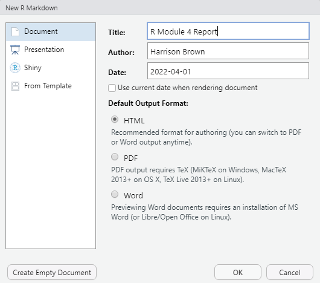
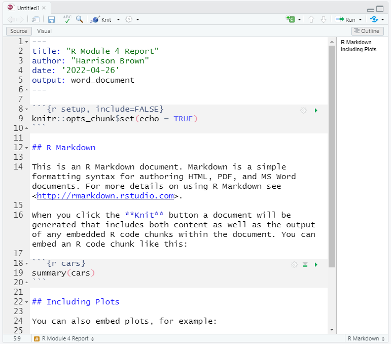

```{r setup, include = FALSE}
knitr::opts_chunk$set(
  fig.align = "center"
  # out.width = "60%"
)
```


# Generating Reports using R Markdown

<!-- For this R Module, we'll be analyzing some survey data; we have an airport quality survey which contains 3,501 survey responses from the Austin-Bergstrom International Airport's customer survey, from the City of Austin.  -->

While generating reports using tools like Excel or Google Sheets is perfectly fine, R is an extraordinarily powerful tool for exploring and visualizing data, and is perfect for this sort of case. However, it's sometimes difficult to quickly generate a report or create a picture, especially when we want to highlight a number of attributes simultaneously.

This is where R Markdown comes in -- R Markdown documents are excellent at integrating both narrative text (paragraphs and "things that you write") and code (including tables, plots, and maps).

This R Module is intended to be an introduction into the field of R Markdown; many formal publications, websites, and documents are written almost entirely in R Markdown (including this website!) As such, there's no way this Module could tell you everything you need to know about R Markdown, but I encourage you to take the time to learn how to use R Markdown in your coding. 


## What is Markdown?

Markdown is a popular "markup language" designed to format plain-text data, such as comments on many websites and documentation for code. In text editors like Microsoft Word or Google Docs, called "What you see is what you get (*WYSIWYG*)" editors, there are buttons for making text italic, bold, underlined, etc., but it's often difficult to transfer that information from one editor to another; if you copy italic text from a Word document into a program like Notepad, you lose all your formatting. 

Markdown, however is designed to be a "What you type is what you get (*WYTIWYG*)" language. If you want to *italic* text, you wrap your text with single \*asterisks\* or \_underscores\_. If you want **bold** text, you \*\*use\*\* \_\_two\_\_, and you can ***combine*** them with \*\*\*three\*\*\*.

There are a ton of other formatting options available, such as lists, links, etc. This module isn't intended to teach Markdown, but rather a variant called R Markdown. For more information regarding Markdown, you can use sites like [Handbook's Markdown Guide](https://about.gitlab.com/handbook/markdown-guide/) or resources such as Stack Overflow.

## R Markdown

R Markdown is a variant of Markdown that is designed to work with R code. In addition to all of the standard Markdown formatting rules, R Markdown allows you to embed and run R code directly in your document, in sections called *code chunks*. This lets you not only run your code, but generate a document with text as well; perfect for writing up labs! Once you get the hang of R Markdown documents, you won't want to write up reports in Word anymore. Rather than endlessly take screenshots and paste into a document, you can embed your code in an R Markdown document, and it'll insert the plots and graphs that you generate *directly*, like this:

<pre><code>```{r code-example}

x <- seq(-1, 1, length = 20)

y <- dnorm(x)

plot(x, y)

```</code></pre>

Which gives you:


```{r code-example, echo = FALSE, out.width = "50%"}
x <- seq(-1, 1, length = 20)
y <- dnorm(x)

plot(x, y)
```

Or, if you want to print a table, you can use:

<pre><code>```{r table}

head(mtcars)

```</code></pre>

Which gives:

```{r table, echo = FALSE}

head(mtcars)
```


# Getting Started

Before we do anything with R Markdown, we need to do a bit of setup to make sure that R Studio is good-to-go in a few ways. 

Mainly, we'll need to install a few R packages:

  - `rmarkdown`, `knitr`, `markdown`, and `mime`: These allow R Studio to work with Markdown and R Markdown
  - `tinytex`: This package is a lightweight $\LaTeX$ distribution and is necessary to export as a .PDF.
    - After installing this package, run `tinytex::install_tinytex()`. This step might take some time. 
    - If you have difficulties exporting to a .PDF, I'd recommend outputting to Word or HTML.
  

To get things running, you can just run the following code:

```{r packages, eval = FALSE}
pkgs <- c("rmarkdown", "knitr", "markdown", "mime", "tinytex")

install.packages(pkgs)

tinytex::install_tinytex()
```

Then, restart R Studio.


Let's get started by creating a new R Project, as in previous R Modules. Once you have that set up, we want to create a new R Markdown document. Navigate to `File > New File > R Markdown`. Give it a title, "R Module 4 Report", enter your name, and select `HTML` as the output format. 


```{r nrmd, echo = FALSE}

```


You should see a file that looks something like this:

```{r rmd, echo = FALSE}

```

Go ahead and hit Save (`Ctrl-S`) and save your document. When you create a new R Markdown document, it comes with some "example text", such as how to run code and insert "code chunks". Feel free to browse this example text, but delete everything outside the header (your header is the text surrounded by three dashes, `---`).

## YAML Header

One of the most important parts of an R Markdown document is the *YAML Header* -- the beginning of the document surrounded by `---`. YAML is a special kind of "data serialization language"; basically, it's a way of storing "options" in plain-text format. Don't worry too much about the details for now -- this is an introduction, after all -- but just remember that most of your important options like `title`, `date`, `output`, etc. are stored here. 


## Code Chunks

Code Chunks are the lifeblood of R Markdown documents; they allow you to run R code within your document, giving you the ability to embed tables, plots, figures, and maps directly in your document (no more copy-pasting screenshots!). 

These Code Chunks are surrounded by three backticks, ```` ``` ````, (it's the key to the left of the `1` key on most layouts). To insert a Chunk, you can also type `Ctrl/Cmd-Alt-I`.

The `{r}` within the chunk signifies that the code we're writing is in the R language (likely, you won't ever need to change that for this course, but other options include `html`). Anything in these curly braces is considered "knitr chunk options", which control how your code is run. For example, if you want to run code but not show the code itself in your output document, you can specify `echo = FALSE` in your chunk options (for this course, keep `echo = TRUE` so we can troubleshoot your code!).

More info about chunk options can be found at Yihui Xie's (developer of knitr, rmarkdown, and many other incredible R packages) website at https://yihui.org/knitr/options/


***

## Writing your first Code Chunk

After removing everything but your YAML header, start by inserting a new Chunk (`Ctrl-Alt-I`). Make sure there's a couple lines between your header and your Chunk. 

Within your Chunk (the area between the sets of backticks should be greyed-out) is where you can enter in R code. Generally, you should have a separate Chunk for each "thing" you do; think of them like "paragraphs of code". Not only does this help keep your document tidy, it lets you know exactly where potential problems in your code are.

In your first Chunk, we'll load some data. Just like in R Scripts, you have to load packages with the `library()` function. If you get a message like `Error in loadNamespace(x) : there is no package called 'packagename`, it means you haven't yet, and need to install it with `install.packages("packagename")` (note the quotes here, but not in `library()`!).

<!-- Let's load our airport survey (`airport_survery.csv`) with the `readr` package from the `tidyverse`; enter the code into your first Chunk: -->

```{r, message = FALSE, warning = FALSE}
library(tidyverse)
library(readxl)

survey <- read_xlsx(path = "data/salary_survey.xlsx")
```


You should see three buttons, . The first is for your Chunk options, and allows you to interactively set your options and name your Chunk. The second runs all Code Chunks above the current one, and the last runs the current Chunk itself.

Go ahead and run your Chunk. Oh, some helpful keyboard shortcuts in R Markdown and R in general include (on Windows):

| Keys |        Function            |
|------|----------------|
|`Ctrl Shift Enter`| Runs the current Chunk (wherever your cursor is placed) |
|`Ctrl Alt R` | Runs all Chunks, in order |
|`Alt -` | Enters the `<-` operator |
|`Ctrl 1`| Focuses the cursor on the Editor pane | 
|`Ctrl 2`| Focuses the cursor on the Console pane |
|`Ctrl Shift M`| Enters the `magrittr` `%>%` Pipe Operator |
|`Ctrl Shift K`| "Knits" the current R Markdown document |
|`Ctrl Shift C`| 'Comments' or 'un-comments' code with `#`|

These are by no means all of the most useful shortcuts in R Studio, but they're the ones I use most often. 

***

Manipulating Data

Back to our code, let's create another Code Chunk, in which we'll pull out some of the variables we want to work with. We'll use `dplyr` to select our variables of interest (stored in columns), and the pipe operator `%>%`, which takes whatever is on its left-hand side and "pipes" it into a function on its right-hand side, like so:


<!-- select columns, then separate code chunk for mutating to factor -->


```{r select}
survey_sub <- survey %>%
  select(`Survey Year`, Country, PrimaryDatabase, SalaryUSD, YearsWithThisDatabase, YearsWithThisTypeOfJob, Education)
```

```{r mutate}

survey_sub <- survey_sub %>%
  filter(
    # Some respondents put in the year they started working with the database,
    # which makes it look like they have 2,000 years' experience
    YearsWithThisDatabase <= 50,

    # Same for the following:
    YearsWithThisTypeOfJob <= 50,

    # We're only interested in the U.S.
    Country == "United States",

    # We want to filter out "missing values"
    Education != "Not Asked",

    # Some respondents put in their hourly wage rather than their yearly salary
    SalaryUSD > 1000
  )
```

```{r boxplots}
survey_sub %>%
  ggplot(aes(y = Education, x = SalaryUSD)) +
  geom_boxplot(notch = TRUE)
```


```{r}
survey_sub <- survey_sub %>%
  mutate(
    SalaryLog10 = log10(SalaryUSD)
  )
```

```{r boxplots-log10}

survey_sub %>%
  ggplot(aes(y = Education, x = SalaryLog10)) +
  geom_boxplot(notch = TRUE)
```

Our distribution appears to be much more normal now.


```{r}
survey_sub <- survey_sub %>%
  mutate(
    Education = factor(
      Education,
      ordered = TRUE,
      levels = c(
        "None (no degree completed)",
        "Associates (2 years)",
        "Bachelors (4 years)",
        "Masters",
        "Doctorate/PhD"
      )
    )
  )

summary(survey_sub)
```

Our goal is to perform a Chi-Squared test, which only works on categorical data. Our predictor variable, `Education`, is categorical, but our response variable, `SalaryUSD` is continuous. However, we're not exactly worried yet about specific dollar amounts, just a general "range" of salaries. A common way we describe this is with figures (e.g., a "six-figure" salary). This just means the "number of zeros" in one's paycheck, and we pretty much have that data already (a $log_{10}$) transformation is exactly what that represents). So, if we recode our `SalaryLog10` column to be categorical (e.g., 4-figs, 5-figs, etc.), we can perform a Chi-Squared test.

```{r}
factors <- cut(survey_sub$SalaryLog10, breaks = c(4, 5, 6, 7), labels = c("5 Figures", "6 Figures", "7 Figures"))

survey_sub <- survey_sub %>%
  mutate(
    SalaryFigs = factors
  )
summary(survey_sub)
```

Interesting! It looks like there are only 3 cases where an individual reported a 7-figure salary. We probably want to filter out these cases, as we won't be able to make any significant statistical inference about them (remember n = 30)


Let's perform some final cleaning, and select out only the variables we're interested in:

```{r}
survey_clean <- survey_sub %>%
  select(
    -PrimaryDatabase, -Country, SalaryLog10
  ) %>%
  filter(
    SalaryFigs != "7 Figures"
  ) %>%
  mutate(
    Education = fct_recode(
      Education,
      "None" = "None (no degree completed)",
      "Associates" = "Associates (2 years)",
      "Bachelors" = "Bachelors (4 years)",
      "Masters" = "Masters",
      "Doctorate" = "Doctorate/PhD"
    )
  )

nrow(survey_clean)

summary(survey_clean)
```

We can plot our remaining data, of which there are 2,570 observations:


```{r boxplots-final}
survey_clean %>%
  ggplot(aes(x = YearsWithThisTypeOfJob, y = SalaryFigs, fill = SalaryFigs)) +
  geom_boxplot(notch = T) +
  facet_grid(rows = vars(Education)) +
  labs(
    x = "Years with this type of job",
    y = "Salary Figures",
    title = "Years Experience vs. Salary",
    fill = "Figures"
  )
```


***
***


# Assignment
