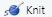

```{r setup, include = FALSE}
knitr::opts_chunk$set(
  fig.align = "center"
  # out.width = "60%"
)
```

# Generating Reports using R Markdown

For this R Module, we'll be analyzing some survey data; our data is a survey of approximately 10,000 individuals who work in the tech industry. The questionnaire was designed to ask respondents' salaries in \$US, their job description, level of education, gender, and several other attributes. We wish to examine the relationship between experience level (years worked in a similar job), education, and salary -- do people with more experience and a higher level of education earn more money? We'll use R Markdown to run our analysis.

While generating reports using tools like Excel or Google Sheets is perfectly fine, R is an extraordinarily powerful tool for exploring and visualizing data, and is perfect for this sort of case. However, it's sometimes difficult to quickly generate a report or create a picture, especially when we want to highlight a number of attributes simultaneously.

This is where R Markdown comes in -- R Markdown documents are excellent at integrating both narrative text (paragraphs and "things that you write") and code (including tables, plots, and maps).

This R Module is intended to be an introduction into the field of R Markdown; many formal publications, websites, and documents are written almost entirely in R Markdown (including this website!) As such, there's no way this Module could tell you everything you need to know about R Markdown, but I encourage you to take the time to learn how to use R Markdown in your coding.

One of the main benefits of R Markdown is that your results are highly reproducible; what you see in the document is the code that actually generates your results. This makes troubleshooting easier for you, and understanding easier for your readers.

## What is Markdown?

Markdown is a popular "markup language" designed to format plain-text data, such as comments on many websites and documentation for code. In text editors like Microsoft Word or Google Docs, called "What you see is what you get (*WYSIWYG*)" editors, there are buttons for making text italic, bold, underlined, etc., but it's often difficult to transfer that information from one editor to another; if you copy italic text from a Word document into a program like Notepad, you lose all your formatting.

Markdown, however is designed to be a "What you type is what you get (*WYTIWYG*)" language. If you want to *italic* text, you wrap your text with single \*asterisks\* or \_underscores\_. If you want **bold** text, you \*\*use\*\* \_\_two\_\_, and you can ***combine*** them with \*\*\*three\*\*\*.

There are a ton of other formatting options available, such as lists, links, etc. This module isn't intended to teach Markdown, but rather a variant called R Markdown. For more information regarding Markdown, you can use sites like [Handbook's Markdown Guide](https://about.gitlab.com/handbook/markdown-guide/) or resources such as Stack Overflow.

## R Markdown

R Markdown is a variant of Markdown that is designed to work with R code. In addition to all of the standard Markdown formatting rules, R Markdown allows you to embed and run R code directly in your document, in sections called *code chunks*. This lets you not only run your code, but generate a document with text as well; perfect for writing up labs! Once you get the hang of R Markdown documents, you won't want to write up reports in Word anymore. Rather than endlessly take screenshots and paste into a document, you can embed your code in an R Markdown document, and it'll insert the plots and graphs that you generate *directly*, like this:

````{=html}
<pre><code>```{r}

x <- seq(-1, 1, length = 20)

y <- dnorm(x)

plot(x, y)

```</code></pre>
````

Which gives you:

```{r code-example, echo = FALSE, out.width = "50%"}
x <- seq(-1, 1, length = 20)
y <- dnorm(x)

plot(x, y)
```

Or, if you want to print a table, you can use:

````{=html}
<pre><code>```{r}

head(mtcars)

```</code></pre>
````

Which gives:

```{r table, echo = FALSE}

head(mtcars)
```

When you're ready to generate a document (whether a PDF, html, or Word document), you **knit** your R Markdown, which runs the included code, formats your text, and exports to a file format of your choice.

# Getting Started

Before we do anything with R Markdown, we need to do a bit of setup to make sure that R Studio is good-to-go in a few ways.

Mainly, we'll need to install a few R packages:

-   `rmarkdown`, `knitr`, `markdown`, and `mime`: These allow R Studio to work with Markdown and R Markdown
-   `tinytex`: This package is a lightweight [$\LaTeX$](https://yihui.org/tinytex/) distribution and is necessary to kint to a .PDF.
    -   After installing this package, run `tinytex::install_tinytex()`. This step might take some time.
    -   If you have difficulties exporting to a .PDF, I'd recommend outputting to Word or HTML.

To get things running, you can just run the following code:

```{r packages, eval = FALSE}
install.packages("rmarkdown", "knitr", "markdown", "mime", "tinytex")

tinytex::install_tinytex()
```

Then, restart R Studio.

Let's get started by creating a new R Project, as in previous R Modules. Once you have that set up, we want to create a new R Markdown document. Navigate to `File > New File > R Markdown`. Give it a title, "R Module 4 Report", enter your name, and select `HTML` as the output format.

```{r nrmd, echo = FALSE}

```

You should see a file that looks something like this:

```{r rmd, echo = FALSE}

```

Go ahead and hit Save (`Ctrl-S`) and save your document. When you create a new R Markdown document, it comes with some "example text", such as how to run code and insert "code chunks". Feel free to browse this example text, but delete everything outside the header (your header is the text surrounded by three dashes, `---`).

## YAML Header

One of the most important parts of an R Markdown document is the *YAML Header* -- the beginning of the document surrounded by `---`. YAML is a special kind of "data serialization language"; basically, it's a way of storing "options" in plain-text format. Don't worry too much about the details for now -- this is an introduction, after all -- but just remember that most of your important options like `title`, `date`, `output`, etc. are stored here.

## Code Chunks

Code Chunks are the essential element of R Markdown documents; they allow you to run R code within your document, giving you the ability to embed tables, plots, figures, and maps directly in your document (no more copy-pasting screenshots!).

These Code Chunks are surrounded by three backticks, ```` ``` ````, (it's the key to the left of the `1` key on most layouts). To insert a Chunk, you can also type `Ctrl/Cmd-Alt-I`.

The `{r}` within the chunk signifies that the code we're writing is in the R language (likely, you won't ever need to change that for this course, but other options include `html`). Anything in these curly braces is considered "knitr chunk options", which control how your code is run. For example, if you want to run code but not show the code itself in your output document, you can specify `echo = FALSE` in your chunk options (for this course, keep `echo = TRUE` so we can troubleshoot your code!).

More info about chunk options can be found at Yihui Xie's (developer of knitr, rmarkdown, and many other incredible R packages) website at <https://yihui.org/knitr/options/>

------------------------------------------------------------------------

## Writing your first Code Chunk

After removing everything but your YAML header, start by inserting a new Chunk (`Ctrl-Alt-I`). Make sure there's a couple lines between your header and your Chunk.

Within your Chunk (the area between the sets of backticks should be greyed-out) is where you can enter in R code. Generally, you should have a separate Chunk for each "thing" you do; think of them like "paragraphs of code". Not only does this help keep your document tidy, it lets you know exactly where potential problems in your code are.

In your first Chunk, we'll load some data. Just like in R Scripts, you have to load packages with the `library()` function. If you get a message like

> Error in loadNamespace(x) : there is no package called 'packagename',

it means you haven't installed the package yet, and need to install it with `install.packages("packagename")` (note the quotes *here*, but not in `library()`!).

Let's load our salary survey (`salary_survey.xlsx`) into R. Our data comes in Excel format, but R has no issues working with this kind of data; the `readxl` package was designed with this in mind! We'll load the `tidyverse` packages as well, so we can manipulate our data with `dplyr` and `forcats`, and visualize our data with `ggplot2`.

```{r, message = FALSE, warning = FALSE}
library(tidyverse)
library(readxl)

survey <- read_xlsx(path = "data/salary_survey.xlsx")
```

You should see three buttons, . The first is for your Chunk options, and allows you to interactively set your options and name your Chunk. The second runs all Code Chunks above the current one, and the last runs the current Chunk itself.

Go ahead and run your Chunk. Oh, some helpful keyboard shortcuts in R Markdown and R in general include (on Windows):

| Keys               | Function                                                |
|--------------------|----------------------------------------------------|
| `Ctrl Shift Enter` | Runs the current Chunk (wherever your cursor is placed) |
| `Ctrl Alt R`       | Runs all Chunks, in order                               |
| `Alt -`            | Enters the `<-` operator                                |
| `Ctrl 1`           | Focuses the cursor on the Editor pane                   |
| `Ctrl 2`           | Focuses the cursor on the Console pane                  |
| `Ctrl Shift M`     | Enters the `magrittr` `%>%` Pipe Operator               |
| `Ctrl Shift K`     | "Knits" the current R Markdown document                 |
| `Ctrl Shift C`     | 'Comments' or 'un-comments' code with `#`               |

These are by no means all of the most useful shortcuts in R Studio, but they're the ones I use most often.

------------------------------------------------------------------------

For this R Module, you should focus on mainly on the document structure and writing your document in R Markdown. Follow along with the code -- whenever you see code in this Module, put it in a Chunk. The questions for this Module will be pretty simple; you'll mostly be describing the distributions and attributes of the data, but the idea is to get you writing your answers in tandem with your Code Chunks, so you can generate a document without having to copy and paste code and images into something like a Word document.

# Manipulating Data

Back to our code, let's create another Code Chunk, in which we'll pull out some of the variables we want to work with. We'll use `dplyr` to select our variables of interest (stored in columns), and the pipe operator `%>%` (loaded with the `tidyverse`), which takes whatever is on its left-hand side and "pipes" it into a function on its right-hand side, like so:

Let's select the columns and work with our data by creating a new `object`, "`survey_sub`". Using `%>%`, we'll pipe our `survey` into the `dplyr::select()` function. Again, you can type `Ctrl-Shift-M` to insert a `%>%`, and `Alt-Minus'`to insert a `<-`.

```{r select}
survey_sub <- survey %>%
  select(`Survey Year`, Country, PrimaryDatabase, SalaryUSD, YearsWithThisDatabase, YearsWithThisTypeOfJob, Education)
```

Now that we have a selection of the columns deemed most important, let's do some additional steps to clean up our data. Because the initial survey was open-ended, some of the responses might not be correct or make much sense. For example, under `YearsWithThisTypeOfJob`, a few respondents answered with values like `2020` and `1997`. It's entirely likely that they meant that they had been working in that job field *since* 2020 or 1997. In a real-world analysis, you should clean the data up by calculating how many years they have actually had, but in this module, we'll simply remove those columns.

We'll also apply this process to a few other columns in the dataset, as well as filtering by other columns to get a subset of the data that we're interested in. Our analysis intends to examine the distribution of salary and education within the United states, so we'll also filter by respondents from within the U.S.

```{r mutate}

survey_sub <- survey_sub %>%
  filter(
    YearsWithThisDatabase <= 50,

    # Same for the following:
    YearsWithThisTypeOfJob <= 50,

    # We're only interested in the U.S.
    Country == "United States",

    # We want to filter out "missing values"
    Education != "Not Asked",

    # Some respondents put in their hourly wage rather than their yearly salary;
    # it's doubtful that anyone only makes $13 USD per year working in this kind
    # of job!

    SalaryUSD > 1000
  )
```

Now, we should visually inspect our data. Let's create a visualization with `ggplot2`: a boxplot of the distribution of salaries within each education level.

```{r boxplots}
survey_sub %>%
  ggplot(aes(y = Education, x = SalaryUSD)) +
  geom_boxplot()
```

Our salaries don't appear normally distributed, do they? When exploring data, it's often a good idea to *transform* your data to help visualize the general distribution of the data. However, we should always be careful when working with transformations when doing any kind of *analysis*, as it could potentially skew our results or lead us to conclusions that might not be entirely accurate. For now, though, we'll transform by taking the base-10 logarithm of our salary variable:

```{r boxplots-log10}
survey_sub <- survey_sub %>%
  mutate(
    SalaryLog10 = log10(SalaryUSD)
  )


# We'll pop this back into our boxplots...
survey_sub %>%
  ggplot(aes(y = Education, x = SalaryLog10)) +
  geom_boxplot()
```

Great! Although the data itself hasn't changed, by applying a transformation, we are able to see the shape and pattern of the distribution of our variable more easily.

------------------------------------------------------------------------

Another consideration when working with data in R is the *class* of the data we're working with. Categorical variables in R are best represented with the `factor` class; rather than a `character`, which can represent any sort of text, a `factor` is used when there is a known set of "choices" or potential values. For example, if you had a dataset of movies, the name of the movie would be best suited as a `character` variable, while the *genre* of a movie might work better as a `factor`.

We'll convert (the R-technical term is "coerce") our `Education` variable to a `factor`, which allows us to see more useful summary statistics about the number of occurrences within each level of education.

```{r}
survey_sub$Education <-
  factor(
    survey_sub$Education,

    # We set this argument to TRUE when the order of our factor matters, or if
    # we intend to compare the "amount" of education (a PhD is a greater
    # "amount" of education than a Bachelors, for example.)
    ordered = TRUE,

    # The `levels` argument requests a character vector of the different factor
    # levels in the dataset, and the order we want them to be in.
    levels = c(
      "None (no degree completed)",
      "Associates (2 years)",
      "Bachelors (4 years)",
      "Masters",
      "Doctorate/PhD"
    )
  )


summary(survey_sub)
```

Our goal is to perform a Chi-Squared test, which only works on categorical data. Our predictor variable, `Education`, is categorical, but our response variable, `SalaryUSD` is continuous. However, we're not exactly worried yet about specific dollar amounts, just a general "range" of salaries. A common way we describe this is with figures (e.g., a "six-figure" salary). This just means the "number of zeros" in one's paycheck, and we pretty much have that data already (a $log_{10}$) transformation is exactly what that represents). So, if we recode our `SalaryLog10` column to be categorical (e.g., 4-figs, 5-figs, etc.), we can perform a Chi-Squared test.

```{r}
factors <-
  # The `cut()` function takes a character vector and "cuts" it into a factor,
  # by looking at values that fall within each break. Think of it as plotting a
  # histogram with a certain number of bins, and assigning each of those bins as
  # a factor level.
  cut(
    survey_sub$SalaryLog10,
    breaks = c(4, 5, 6, 7),
    labels = c("5 Figures", "6 Figures", "7 Figures")
  )

survey_sub$SalaryFigs <- factors

summary(survey_sub)
```

Interesting! It looks like there are only 3 cases where an individual reported a 7-figure salary. We probably want to filter out these cases, as we won't be able to make any significant statistical inference about them (remember n = 30).

Let's perform some final cleaning, and select out only the variables we're interested in:

```{r}
survey_clean <- survey_sub %>%
  # We're not interested in these columns, so we can exclude them with a "-"
  select(-PrimaryDatabase, -Country, SalaryLog10) %>%
  # Likewise, we want to ignore the cases where the salary is 7 figures, so we set our filter criterion to the observations where SalaryFigs is not (!= represents "is not") "7 Figures".
  filter(SalaryFigs != "7 Figures") %>%
  # Even though we filtered out the cases of 7-figure salaries, the "7 Figures"
  # level still exists within our data. We use the `droplevels()` function to
  # remove unused factor levels. Nothing actually changes about our data itself,
  # but it helps keep our results tidy.
  droplevels()


summary(survey_clean)
```

We can plot our remaining data, of which there are 2,570 observations:

```{r boxplots-final}
survey_clean %>%
  ggplot(aes(x = YearsWithThisTypeOfJob, y = SalaryFigs, fill = SalaryFigs)) +
  geom_boxplot() +
  facet_grid(rows = vars(Education)) +
  labs(
    x = "Years with this type of job",
    y = "Salary Figures",
    title = "Years Experience vs. Salary",
    fill = "Figures"
  )
```

------------------------------------------------------------------------

# Finalizing your R Markdown

Once you have all of the code you need embedded in your code chunks (remember, put each block of code in a separate chunk to keep things tidy!), you'll need to *knit* your R Markdown document to some other format. Usually, you can export as either a `.html`, `.pdf`, or `.docx` document; for compatibility, we'll export our document as a Word doc, `.docx`. Knitting to a PDF can sometimes be tricky and requires additional software to be installed -- if you're interested , it's called [tinytex](https://yihui.org/tinytex/), and is quite easy to set up, but it's a bit outside the scope of this Module.

Anyways, make sure that your header (the section between each `---` at the top) looks about like:

    ---
    title: R Module 4
    author: Your Name

    output: word_document

    ---

Whenever you're ready to knit to a Word document, either click the `Knit` icon (), or enter `Ctrl-Shift-K`. This runs the R code in each code chunk and embeds it into a document alongside whatever text you enter between code chunks.


R Markdown is a very powerful tool for writing code alongside text -- this whole series of R Modules was written *entirely* in R Markdown!

------------------------------------------------------------------------

# Assignment

For this assignment, you don't have many questions to answer! Mostly, the goal is to get you working with R Markdown, so the main thing to submit will be the Word Document (or PDF, if you want) generated by R Markdown.
