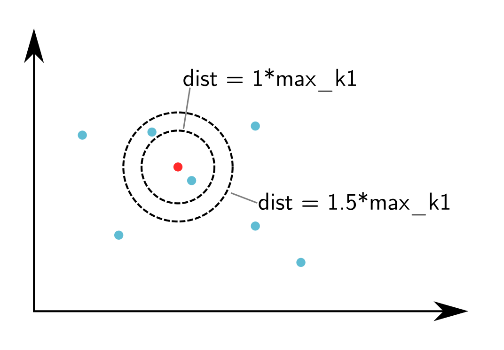
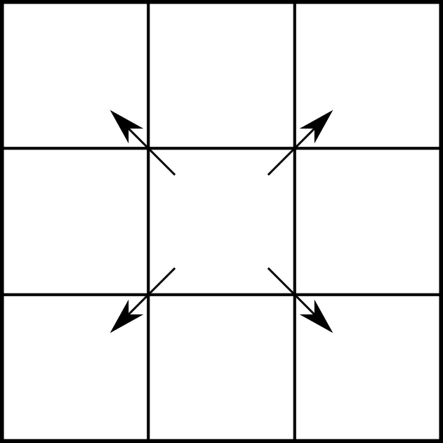
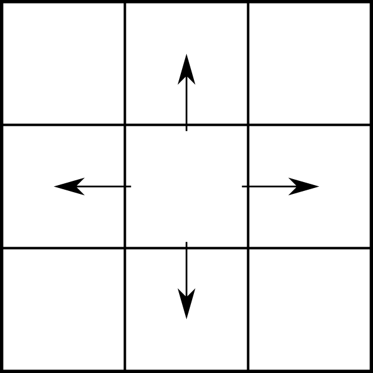
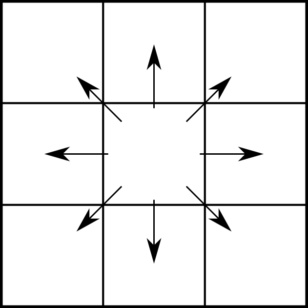
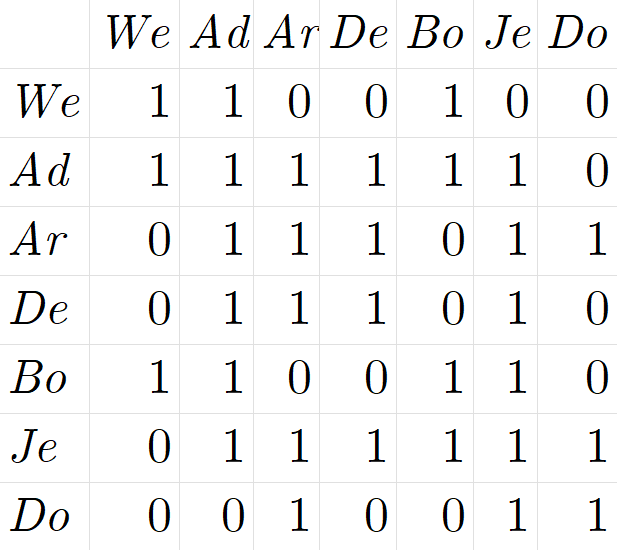

# Introduction to Spatial Autocorrelation

One of the most important laws in Geography is that things that are closer to one-another are more likely to be related to each other; this is Tobler's first law of Geography:

    > Everything is related to everything else, but near things are more related than distant things

This law gives us a foundation for an extremely powerful statistical tool -- Spatial Autocorrelation. This measure assesses the amount of "related-ness" that can be explained by spatial proximity. Our null hypothesis, therefore, is that values occur randomly over space. To reject this null hypothesis means that spatial proximity has some effect on the observed values; think back to the results of R Module 7, and how our residuals seemed to "cluster" in certain parts of the state.

Spatial autocorrelation can be measured in a number of ways; in this module, we'll lay the groundwork for the most widely-used statistic for spatial autocorrelation for a continuous variable: *Moran's I*. This metric is a "global measure" -- it is a single value that defines the entire dataset. 

Before we can jump into calculating the Moran's I, we have a few additional decisions and tasks to perform. This week, we'll walk through the setup for calculating Moran's I, specifically:

1. The choice of neighborhood criterion, and,
2. The creation of the *spatial weights matrix*

# Choosing a neighborhood criterion

Moran's I measures the correlation of a variable with itself across space, based on some criteria about how far away from a given unit other values will be compared. In other words, we have to define a "neighborhood" around each spatial unit to form the basis for comparing the value of a spatial unit with the values in its neighborhood.

Neighborhoods can be defined in a number of ways, but the two basic choices are either a *distance-base* approach or a *common boundary-based* approach. Distance-based approaches can work for both point and areal (polygon) data, although we typically assign an area to a point by calculating its centroid. Common boundary-based approaches are specifically used for areal data, because points don't have "boundaries".

## Distance-Based

Distance-based approaches require you to specify some distance "threshold" that will be used to define which points or centroids will be classified as "neighbors" for the autocorrelation tests. The larger the distance, the more neighbors we expect. The figure below illustrates that concept. If we set a distance band at a distance of 1 around the focal unit (the red point), we'll only have one other point in the neighborhood. If we increase the distance by 50% to 1.5, we'll have two points in the neighborhood. So we always have a challenge in front of us: what distance do we use?

## Boundary-Based

For boundary-based approaches, however, we define neighbors slightly differently. Instead of establishing a distance around a point and including all poitns within that distance, neighbors are defined by whether or not two areal units share boundaries. This can be done in several ways, thinking about it like a chess board. If neighbors should share 0-length boundaries (corners), we have a "Bishop's case" neighborhood; if we exclude 0-length boundaries but include boundaries with length > 1 (edges), we have a "Rook's case" neighborhood. Combining both cases, we have a "Queen's case" neighborhood. Just as before, we are challenged to define what counts as a 'shared' boundary.

| Bishop 	| Rook 	| Queen 	|
|--------	|------	|-------	|
||||

***

# Creating the Spatial Weights Matrix

$w_{ij} = $ 
