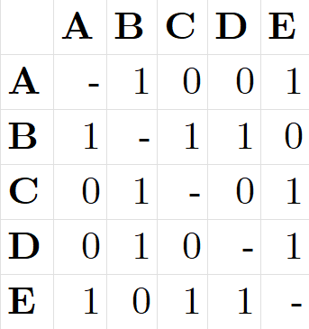
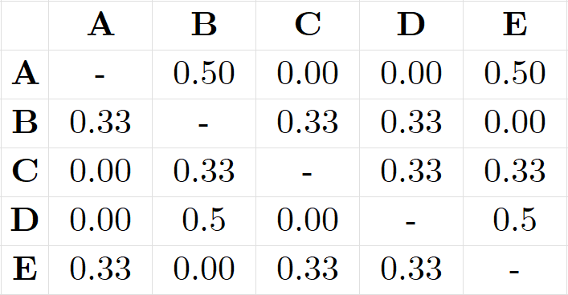
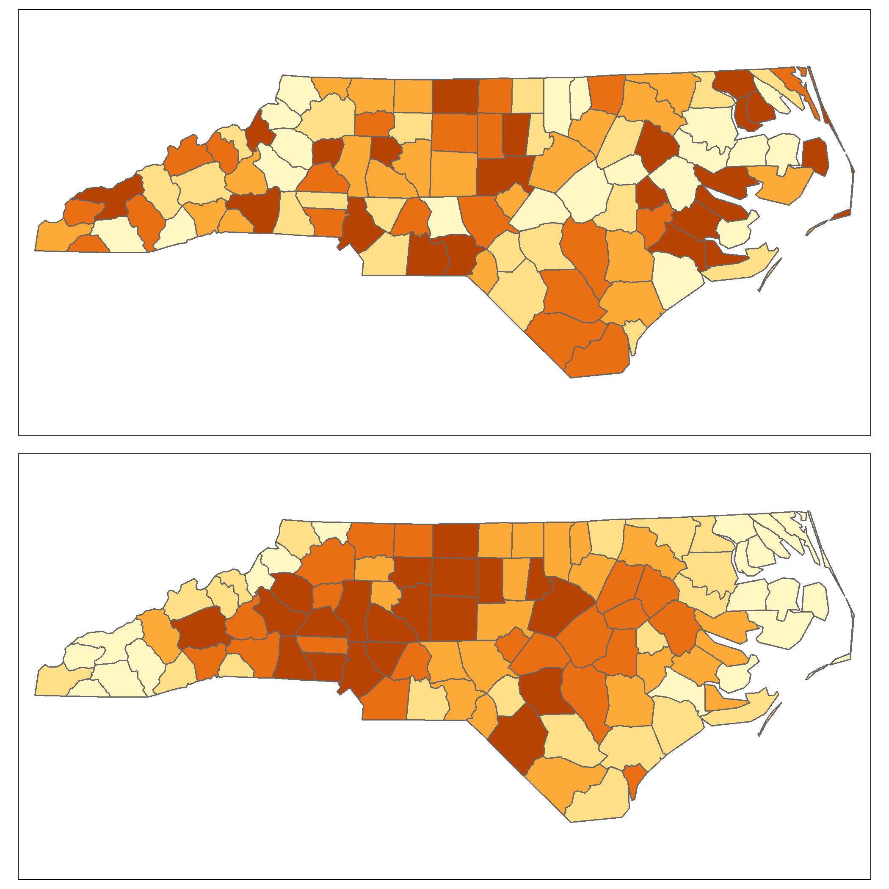
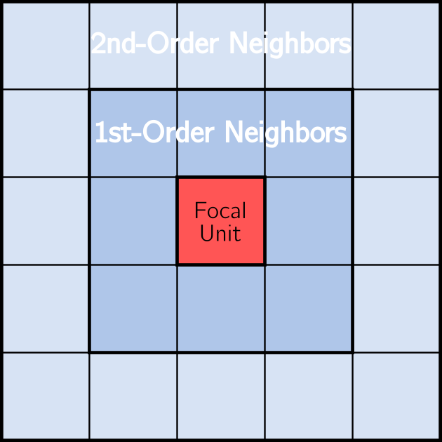

```{r include=FALSE}
library(sf)
library(spdep)
library(tidyverse)
library(tmap)

knitr::opts_chunk$set(
  fig.align = "center"
)
```


***

# What is Spatial Autocorrelation?

In the previous R Module, we introduced the idea of calculating a "spatial neighborhood" and the need for a formal definition of this neighborhood prior to spatial autocorrelation testing. Although these constructs are relatively easy to make in R with the `spdep` package, we have a lot of options; which method is best? Unfortunately, there isn't a single best method to use; it depends on the data you have, the scale you're looking at, and what you wish to accomplish.

Therefore, the results of spatial autocorrelation testing depend heavily on the choices for your spatial neighborhood. The best recourse is to first theorize the spatial form of the process you're investigating and to test several spatial neighbor constructs to see if your results change significantly when your neighborhoods change.

# Assigning Weights

Before we test spatial autocorrelation on our data, there's another step for us to perform after we create our neighbor constructs -- our spatial weights matrix $W_{ij}$. Recall from the previous Module that $W_{ij}$ is an $n \times n$ matrix, where $n$ is the number of spatial units (points or areas). The cells of the matrix record the presence or absence of connections as a binary measure; $0$ indicates no connection between the two units, and $1$ indicates a connection.

We use binary measures because it's often difficult to determine the "relative influence" of spatial units on one another -- North Carolina, for example, borders both Virginia and Georgia, but its border with Virginia is much longer. So, rather than guess the value, we start with a binary measure; either there exists a connection or there doesn't.

Suppose we had a study region that consisted of five counties and we applied one of the neighborhood criteria from last R Module. Our $W_{ij}$ would be a $5 \times 5$ matrix, with cell values of either $0$ or $1$, and might look something like this:

```{r weights-matrix, echo = F, out.width="40%", fig.align='center'}


```


## Standardizing Weights

Notice that some counties may have more or fewer connections than others, meaning this wasn't made with $k$-nearest neighbor. For example, county `A` has 2 neighbors (we don't count self-connections, so `A`'s neighbors are `B` and `E`). However, `E` has 3 neighbors: `A`, `C`, and `D`. Because these connections are roughly analogous to influence (counties with more connections likely have a greater influence on the surrounding areas), we should set the total influence upon a given unit to 1. In other words, we need to standardize the connections, typically done by row standardizing.

To row standardize a matrix, we first sum each row, then divide each non-zero cell in that row by the sum total:

```{r weights-matrix-2, echo = F, out.width="50%", fig.align='center'}


```

Row standardization splits the influence from neighboring units proportionally. Put another way, row standardizing weights the influence each county has on its neighbors proportionally and standardizes the total influence on each spatial unit. There are other kinds of weighting schemes but row standardization in commonly used, and is relatively easy to perform in R. Once we're done with this step, we can finally calculate our global Moran's I measure. To demonstrate, let's return to our data from the previous R Module.


# Calculating the Spatial Weights Matrix

Load the required libraries and read in the shapefile to R. Re-project the data to NAD 83 / UTM Zone 17N (please reference R Module 8), then use `poly2nb` to create a Queen's case $W_{ij}$. After that, we'll use the `nb2listw()` function to row standardize our matrix.

```{r, include = FALSE}
NC <- read_sf("data/NC_REGION.shp")

NC_UTM <- st_transform(
  x = NC,
  crs = st_crs("EPSG:26917")
)
queen_nb <- NC_UTM %>%
  tibble::column_to_rownames("NAME") %>%
  st_as_sf() %>%
  poly2nb(queen = TRUE)
```

```{r}
queen_nb_w <- nb2listw(
  neighbours = queen_nb,
  # The default style, "W", tells us that we're performing row standardization
  style = "W",

  # Don't worry about this option for now, but it'll be important to include
  # later.
  zero.policy = TRUE
)

summary(queen_nb_w)
```

Printing the new object itself doesnt show us our $W_{ij}$ directly (technically it isn't stored as a matrix in R)


***


# Global Moran's I

Moran's I is a test of whether a variable autocorrelates with itself across space. The calculation for Moran's I is actually quite similar to the Pearson's $r$ correlation; the main differences are that:

1. Moran's I is a test of a single variable, and 
2. Moran's I requires us to first define our spatial weights matrix $W_{ij}$

We've done this already, so now we're finally able to calculate Moran's I.

## What does *I* represent?

The Moran's I test returns a single value, ranging from $-1$ to $1$, indicating "autocorrelation". When $I = -1$, the variable in question is perfectly "negatively spatially autocorrelated" -- high values neighbor low values -- think about them like similar poles on bar magnets and how they "want" to repel each other. When $I = 1$, the variable in question is perfectly "positively spatially autocorrelated" -- high values "clump" together, as do low values.

What happens when $I = 0$? This indicates "spatial randomness" -- sometimes high and low values occur, sometimes they are dispersed, but there's no systematic pattern governing their distribution.

Mathematically, the calculation for $I$ is as follows:

$$I = \frac{1}{s^2}\frac{ \sum_i\sum_j(y_i-\bar{y})(y_j-\bar{y}) }{ \sum_i\sum_j W_{ij} }, $$

With $$s^2 = \frac{(\sum y_i -\bar{y})^2}{n}$$

Let's break this down:

- $s^2$ is the sampling variances, defined by the sum of the difference between each value and the mean, then squared, and then divided by the number of spatial units $n$. 
- Our denominator is the total sum of all the cells in our spatial weights matrix $W_{ij}$.
- The numerator is the sum of the differences in between $y_i$ and $y_j$ (the values in our rows and columns) with our overall mean, $\bar{y}$.

Hopefully, you won't ever have to calculate this by hand, but it's important to see what the test is actually performing. 


Because Moran's I is a single value, it's easy to interpret; it shows the "global measure" of autocorrelation. However, actually calculating the Moran's I is somewhat difficult.


## Calculating Moran's I

The real challenge in calculating Moran's I is in creating the sampling distribution that we need to find our critical values and our $p$-values used in hypothesis testing. The safest assumption is that the statistical distribution (not spatial distribution!) of our variable in question is not normal. However, we can approximate a normal sampling distribution through spatial randomization.

The actual values assigned to each spatial unit are randomized repeatedly -- the values are moved to a randomly-designated spatial unit -- to create a distribution that we use for our hypothesis test. The expected value of $I$ for that "theoretical" distribution approaches $0$ as the number of spatial units increases, and the standard deviation of the sampling distribution can only be derived once $W_{ij}$ has been created.

What this essentially means is that we're comparing our measured values against a "hypothetical distribution" in which those values are distributed randomly across space. 

For example, the top map shows a variable that is randomly distributed across space, and the bottom map shows one that likely is spatially autocorrelated:

```{r moran-example, echo = FALSE, fig.align='center', out.width="50%"}

```


This is the null hypothesis associated with Moran's I: spatial randomness. If the variable in question doesn't spatially autocorrelate (i.e., it doesn't differ significantly from a hypothetical random spatial distribution), we do not reject the null. However, if the variable does autocorrelate and our $p$-values are less than our $\alpha$ (usually 0.05), then we reject the null hypothesis and can confidently state that our variable spatially autocorrelates.


More formally, our null hypothesis is that our calculated $I$ is equal to the expected $I \approx 0$. The alternative hypothesis is that the calculated $I \neq$ the expected $I$. Thus, we have a two-tailed test.

***

# Performing the Moran's I Calculation

Let's try this on the variable for manufacturing jobs in the year 2000, `MNEM2000`:

```{r}
moran.test(
  x = NC_UTM$MNEM2000,
  listw = queen_nb_w,
  zero.policy = TRUE,
  alternative = "two.sided"
)
```

The calculated Moran's I is listed (as `statistic`) along with the expected value of the "hypothetical" sampling distribution (as `Expectation`), as well as the $p$-value. The expected value is around -0.01, and the calculated $I$ of 0.3884 is **not** close to the expected value (which should be close to 0). Unsurprisingly, our $p$-value is also fairly low, at $3.239\times 10^{-10}$.

This means than using a sampling distribution created by randomization and a row-standardized Queen's case spatial weights matrix, we would have much less than a 1% chance of making a Type-I error if we reject our null hypothesis (of no spatial autocorrelation). We can confidently say, therefore, that `MNEM2000` is a spatially autocorrelated variable. 

## Questions

**1. Calculate Moran's I for the following variables in the dataset. List the Moran's I values and p-values for each variable in a single summary table:**

  - `MNEM2000`
  - `MNEM1990`
  - `TOTJOB2000`
  - `TOTJOB1990`

**Provide your R code for the Moran's I tests (not the results themselves -- that's what the table is for).**

# Spatial Weights Matrix

To better ensure our results are accurate, it's important to test other neighborhood criteria. Because our spatial weights matrix is used to calculate Moran's I, our result could simply be due to the choice of neighborhood criterion. What if we used a different neighborhood construct? Let's try with a Rook's case, row-standardized as normal:


```{r}
rook_nb_w <- NC_UTM %>%
  tibble::column_to_rownames("NAME") %>%
  st_as_sf() %>%
  poly2nb(queen = F) %>%
  nb2listw(
    style = "W",
    zero.policy = TRUE
  )

moran.test(
  x = NC_UTM$MNEM2000,
  listw = rook_nb_w,
  zero.policy = T,
  alternative = "two.sided"
)
```

Did anything change? It looks like our $I$ changed slightly, but our $p$-value is still significant at $\alpha = 0.05$, but suggests that our Moran's I can be sensitive to changes in our spatial weights matrix. 

## Questions

**2. Calculate Moran's I for the `MNEM2000` variable using four different versions of $W_{ij}$:**

  - Queen's Case
  - Rook's Case
  - $k = 4$ nearest neighbors
  - Maximum Distance (100% threshold)

**Make sure your weights matrices are row standardized. Provide a table that summarized the calculated I, $p$-values, and average number of connections per county. Discuss any systematic changes you observe in I, $p$-values, and average links.**

***
***


# Spatial Correlogram

If we want to explore how spatial autocorrelation changes over distance, we can create a spatial correlogram. This is a graph with a measure of spatial autocorrelation on the y axis and the different distance-based or boundary-based "bands" on the x axis. Consider the example of a Queen's case spatial weights matrix: we could also define "2^nd^-order neighbors"; these would be the neighbors to the original neighbors. For example:

```{r neighbors, echo = F, fig.align = 'center', out.width="40%"}

```

The correlogram calculates Moran's I at these different orders, called "lags", to assess how spatial autocorrelation varies across distance. When you create the correlogram, you need to specify how many lags you want, and which autocorrelation test to perform (we'll use Moran's I).

Let's do this for our `MNEM2000` variable using a Queen's case $W_{ij}$ and 4 lags. In this function, we specify the **non-weighted** neighbor object (`queen_nb`, not `queen_nb_w`), the number of lags (4), and that we're using Moran's I for our test:

```{r correlogram-1}
corr_gram <- sp.correlogram(
  neighbours = queen_nb,
  var = NC_UTM$MNEM2000,
  order = 4,
  method = "I",
  style = "W",
  zero.policy = TRUE
)


plot(corr_gram)
```

What this is telling us is that the manufacturing count for a given county is similar to its neighboring counties and less similar the further away these counties are. If we were to plot more lags, we might see Moran's I rise again. If so, this would indicate that there was a significant distance between manufacturing centers within the state, something suggested by our previous results.

## Questions

3. **Create and provide the spatial correlogram plots for the `MNEM2000` variable, using the Queen's case, Rook's case, $k = 4$ nearest neighbors, and Maximum Distance spatial weights matrices. Make sure to label the plots! What is the general relationship between manufacturing and distance that can be derived from these plots?**

***
***


# Local Moran's I

The *global* Moran's I provides a single statistic that describes the "overall" spatial autocorrelation of a variable, but doesn't actually tell us *where* we find clustering among our spatial units. Another consideration is that there is a specific set or region of spatial units that are contributing to a significant global Moran's I value; for example, perhaps `MNEM2000` is only autocorrelated in the Piedmont region, or in the peripheries, etc.

To address these questions, we need a **Local Indicator of Spatial Autocorrelation** (LISA). The "local Moran's I" is exactly such a statistic, and it returns a value for each area or point using our $W_{ij}$ to define the neighborhood around each area or point.

As shown below, the formula to calculate the local Moran's I is different the the formula we saw earlier:

$I_i = z_i \sum_j W_{ij} z_j$, where $z_i$ and $z_j$ represent the deviations from the mean. 

Rather than summarize spatial autocorrelation into a single value, local Moran's I assigns a measure of spatial autocorrelation to each spatial unit. It does this by calculating the average value of the variable, for example `MNEM2000`, among neighboring units, which is called the lag variable. Then, the value of each lag is compared to the value in the focal unit; if the value in the lag is similar to the value of the focal unit, we have positive local spatial autocorrelation.

This process is repeated for every spatial unit in the data, resulting in new localized measures.  Because we will have a measure for every unit, we can explore the resulting patterns using scatter plots and maps. We won't have a single $p$-value either; instead, we'll have a $p$-value for each 'neighborhood'.

***

## Calculating Local Moran's I

To calculate Local Moran's I, we'll use the `localmoran()` function from `spdep`. Just as with the global Moran's I, we have to specify both the variable to test and the $W_{ij}$ to use. Let's use `MNEM2000` again, and the Queen's case matrix.

```{r}
local_moran_queen <- localmoran(
  x = NC_UTM$MNEM2000,
  listw = queen_nb_w,
  zero.policy = TRUE,
  alternative = "two.sided"
)

head(local_moran_queen)
```

What does this tell us? Call `?localmoran` to get an explanation as to each column.

Just like regression residuals, we can explore these local measures with a scatter plot and a map. Let's start with a scatterplot of the actual manufacturing counts for each county against the lag counts for each county:

```{r loc-moran-scatter}

moran.plot(
  x = NC_UTM$MNEM2000,
  listw = queen_nb_w,
  labels = NC_UTM$NAME,
  xlab = "Manufacturing Counts",
  ylab = "Lag Manufacturing Counts"
)
```

This plot shows us quite a bit of information. First, we should note that the mean values of both our manufacturing counts and the lag manufacturing counts (average counts from each county's neighbors) are shown by the dashed lines. This allows us to break up the plot into four quadrants:

1. The upper left quadrant shows us counties with counts below the mean, surrounded by counties above the mean. 
2. The upper right shows high-count counties surrounded by high-count counties.
3. The lower left is the "low-low" counties.
4. The lower right is the "high-low" counties.


It's important to note that the way each county is assigned is dependent on our significance level; right now it's still $\alpha = 0.05$. Counties on the above scatter plot with the 'diamond' symbol are those where the $p$-value is less than our significance level. If we 

```{r}
quadr <- attr(local_moran_queen, "quadr")[, 1]

NC_localmoran <- NC_UTM

NC_localmoran$Quandrant <- quadr

NC_localmoran$p.value <- local_moran_queen[, 5]

sig_level <- 0.05

NC_localmoran <- NC_localmoran %>%
  mutate(
    Quadrant_Sig = if_else(
      p.value <= sig_level,
      true = as.character(Quadrant),
      false = "Insignificant"
    ) %>%
      as.factor()
  )
```

Let's plot this with a color palette to highlight where there are significant levels of local spatial autocorrelation:

```{r local-moran-map}

lm_pal <-
  c(
    "High-High" = "red3",
    "High-Low" = "red",
    "Insignificant" = "gray90",
    "Low-High" = "skyblue",
    "Low-Low" = "royalblue"
  )


tm_shape(NC_localmoran) +
  tm_polygons(
    col = "Quadrant_Sig",
    palette = lm_pal
  ) +
  tm_layout(
    main.title = "LISA Cluster at Alpha = 0.05",
    frame = F
  )
```
